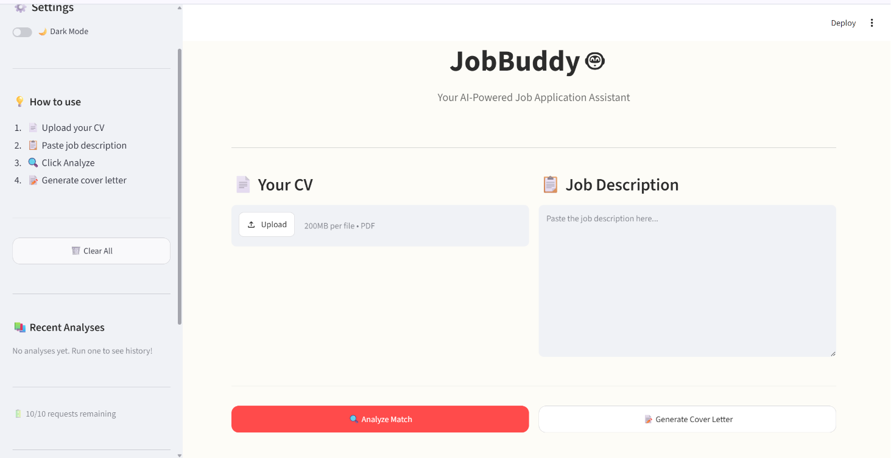
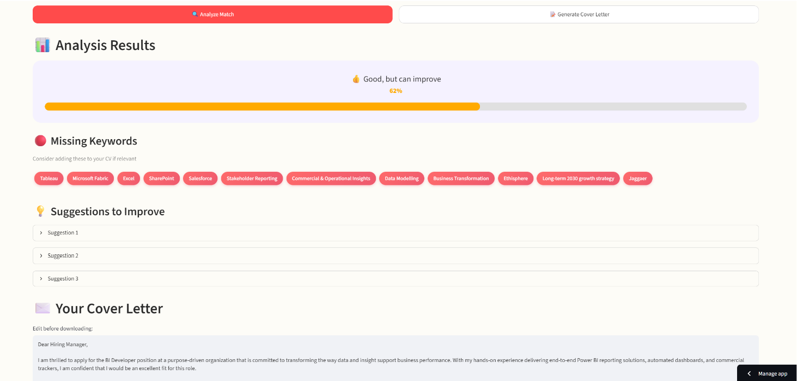

<div align="center">

# 🤖 JobBuddy

### Your smart assistant for landing your next job

An AI-powered tool that analyzes your CV against any job description, 
identifies missing keywords, gives improvement suggestions, and generates 
tailored cover letters — all in seconds.

🌐 **[Try Live Demo →](https://jobbuddy-samruddhispathak.streamlit.app)**

</div>

---

## ✨ Features

🎯 **Smart CV Analysis** — Upload your CV, paste a JD, get an instant match score (0-100%)

🔍 **Missing Keywords Detection** — See exactly what recruiters are looking for that you don't have

💡 **Actionable Suggestions** — Get specific tips to improve your CV for that role

✉️ **AI Cover Letter Generator** — Generate a tailored, professional cover letter in seconds

📄 **Multiple Export Formats** — Download as TXT or formatted PDF, or copy to clipboard

🌙 **Dark Mode** — Easy on the eyes for late-night job hunts

📚 **Analysis History** — Keep track of your recent analyses

💬 **Feedback Loop** — Send feedback directly from the app

💻 **Mobile Friendly** — Works on phone, tablet, and desktop

---

## 🖥️ Screenshots

### Main Interface


### Analysis Results


---

## 🛠️ Tech Stack

- **Frontend & Backend:** [Streamlit](https://streamlit.io) (Python)
- **AI Engine:** [Groq API](https://groq.com) (LLaMA 3.1 8B model)
- **PDF Processing:** PyPDF2
- **PDF Generation:** ReportLab
- **Feedback Collection:** Google Apps Script
- **Deployment:** Streamlit Cloud (free tier)

**100% free to build and run** — no paid APIs, no hidden costs.

---

## 🚀 How It Works

1. **Upload** your CV (PDF format)
2. **Paste** the job description you want to apply for
3. Click **🔍 Analyze Match** — AI scores your fit (0-100%)
4. Review **missing keywords** and **improvement suggestions**
5. Click **📝 Generate Cover Letter** — AI writes a tailored letter
6. **Edit** if needed, then **download** as TXT or PDF, or copy to clipboard

---

## 💡 Why I Built This

I built JobBuddy because I was applying to dozens of jobs a month and 
spending hours tailoring each application. I thought: *"There has to be 
a faster way."*

So I built the tool I wished existed.

What started as a personal productivity hack turned into a portfolio 
project, a learning experience in AI integration, and (hopefully) 
something useful for other job seekers too.

---

## 🎯 What I Learned Building This

- Integrating LLM APIs (Groq) into real applications
- Prompt engineering for structured, reliable outputs
- Building intuitive UI/UX with Streamlit + custom CSS
- Handling file uploads and text extraction from PDFs
- Generating dynamic PDFs with ReportLab
- Session state management for persistent UI
- Rate limiting to protect API quotas
- Deploying Python apps to the cloud for free

---

## 🏃 Run Locally

Want to run JobBuddy on your own machine?

```bash
# Clone the repo
git clone https://github.com/YOUR_GITHUB_USERNAME/jobbuddy.git

# Navigate
cd jobbuddy

# Create virtual environment
python -m venv venv
source venv/bin/activate  # On Windows: venv\Scripts\activate

# Install dependencies
pip install -r requirements.txt

# Add your Groq API key to .env file
echo "GROQ_API_KEY=your_key_here" > .env

# Run the app
streamlit run app.py
